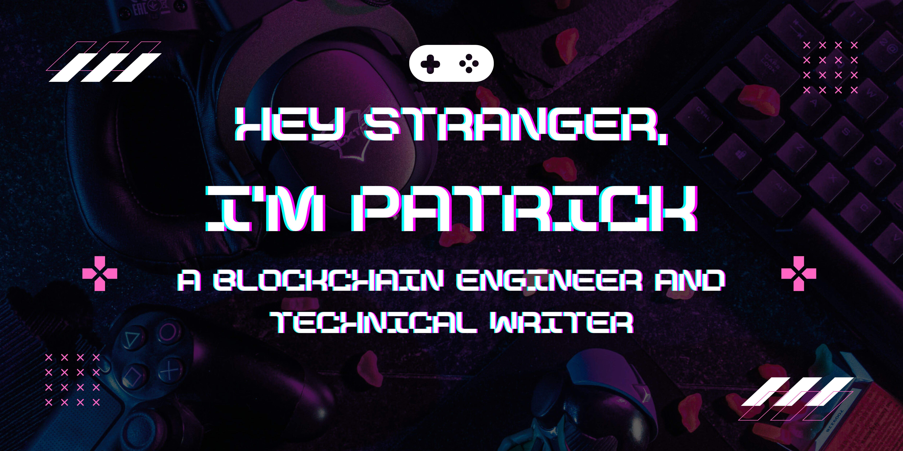

<h1 align="center">
 Patrick Ehimen | Blockchain Engineer
</h1>

_Forging digital destinies in the blockchain frontier, I craft code that bridges worlds and reshapes reality. My mission? To build decentralized systems that empower humanity beyond imagination._

[🌟 Fuel The Decentralized Revolution 🌟](#)

## 🔧 Arsenal of Innovation

Behold the cutting-edge technologies at my command:

### Blockchain & Web3

- Ethereum & EVM-compatible chains
- Solana & Starknet
- Layer 2 solutions (Base, Optimism, Arbitrum)
- IPFS & Filecoin

### Smart Contract Development

- Solidity (Advanced patterns & Gas optimization)
- Rust for Solana
- Foundry (Testing & Deployment)
- Hardhat

### Frontend Web3 Integration

- viem.sh
- ethers.js
- web3.js
- @solana/web3.js

### Languages & Frameworks

- TypeScript
- Rust
- Next.js & React
- Node.js

### Development Tools

- Git & GitHub Actions
- Docker

### DeFi Protocols

- Uniswap v3
- Aave
- Compound

---

 

